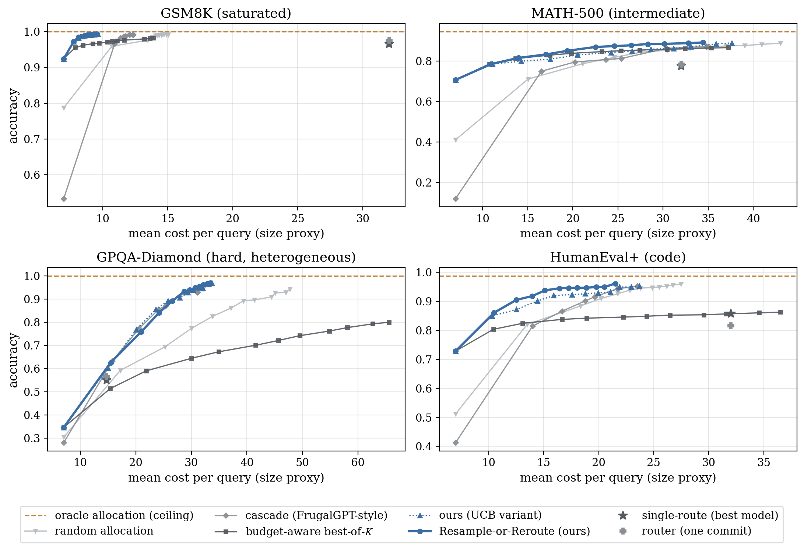
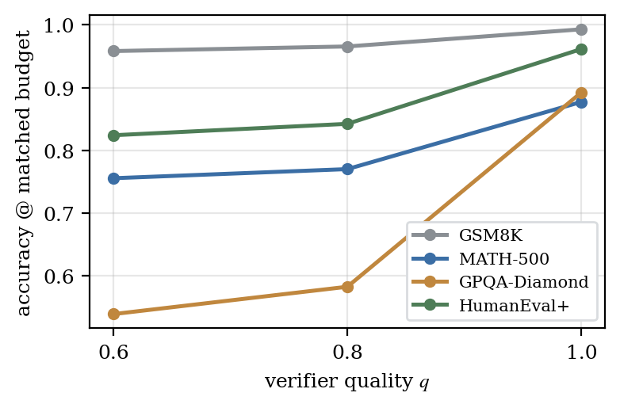
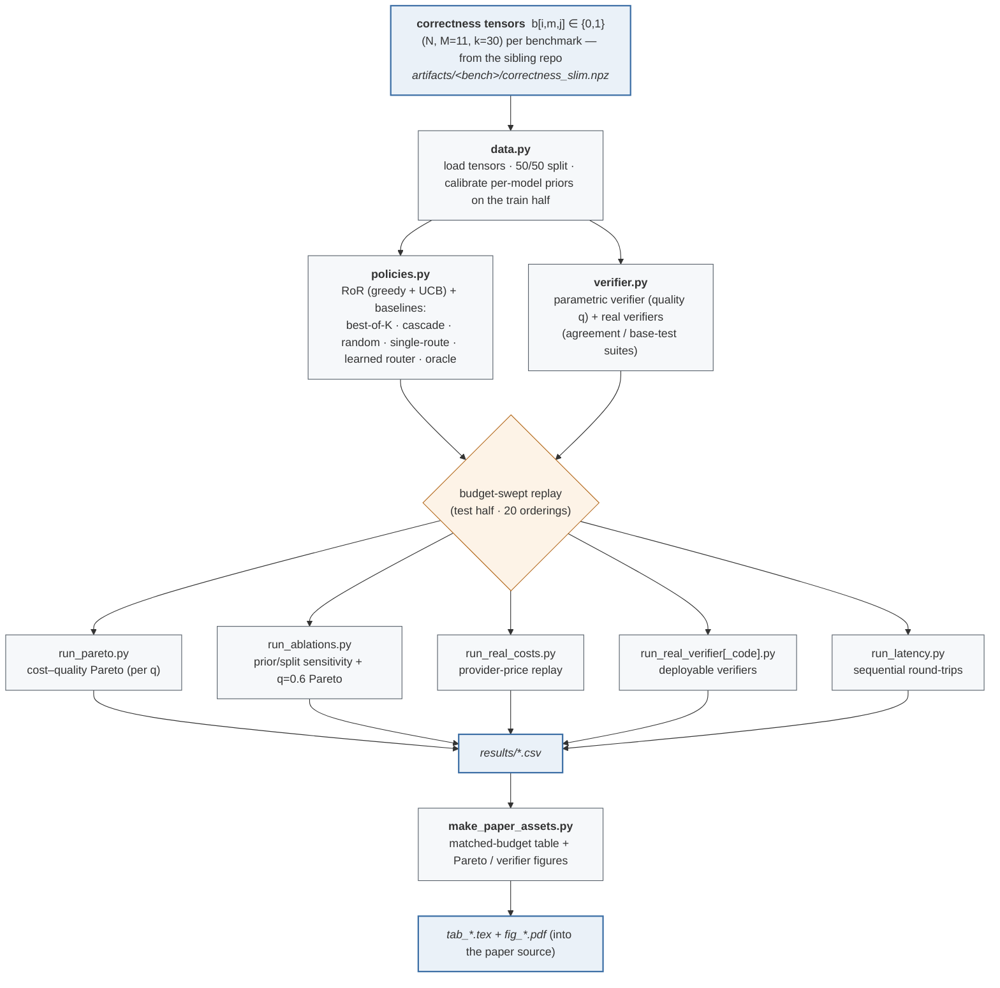

# Resample or Reroute? Budget-Aware Test-Time Model Selection for LLMs


[](https://arxiv.org/abs/2607.08665)
<!-- venue badge — add once accepted at a journal -->

> Reproducibility companion for the paper **“Resample or Reroute? Budget-Aware
> Test-Time Model Selection for Large Language Models”**
> ([arXiv:2607.08665](https://arxiv.org/abs/2607.08665)).
> **CPU-only replay, no API key** — every experiment *here* replays precomputed
> multi-draw correctness tensors: no model inference, no GPU, no closed
> endpoint. The tensors themselves were generated **once, on GPUs** — see
> [Generation environment](#generation-environment).
>
> **Built on.** The companion analysis **“How Much of the Routing Gap Is
> Real?”** ([arXiv:2607.03436](https://arxiv.org/abs/2607.03436)) proves the
> recoverability asymmetry that RoR exploits; its repo
> [routing-oracle-experiment](https://github.com/luka-krixvon/routing-oracle-experiment)
> generates and releases the correctness tensors replayed here.
>
> **The question.** Given a fixed per-query cost budget and an *imperfect*
> verifier — the conditions a real serving system actually faces — should the
> system **resample** the model it already committed to, or **reroute** to a
> different (possibly costlier) one? This code measures how a policy that decides
> this *per query* compares against the standard baselines, and is explicit about
> where its advantage holds and where it does not.

<p align="center"></p>

*Cost–quality Pareto fronts on the four regenerated pools (perfect verifier;
mean over 20 draw orderings). The policy (blue) dominates or matches every
budget-scalable baseline on GSM8K, MATH-500, and GPQA; on the near-saturated
HumanEval+ it leads at low budget but converges with cascade and random
allocation at high budget. The amber dashed line is the non-deployable
oracle-allocation ceiling.*

---

## TL;DR

Test-time compute is usually spent bluntly: the same budget on every query, the
same model on every problem. **Resample-or-Reroute (RoR)** spends each unit of
budget on whichever action — one more draw of the committed model, or the first
draw of a new one — has the highest **estimated marginal correctness per unit
cost**. Both actions are scored on one axis, which is what makes them competing
uses of a single per-query budget.

Accuracy at a matched mid budget (point nearest mean cost 26; cost =
parameter-size proxy):

| Policy | GSM8K | MATH-500 | GPQA-Diamond | HumanEval+ |
|---|---:|---:|---:|---:|
| **Resample-or-Reroute (ours)** | **0.993** | **0.877** | **0.892** | **0.962** |
| budget-aware best-of-$K$ | 0.983 | 0.850 | 0.644 | 0.852 |
| cascade (FrugalGPT-style) | 0.992 | 0.812 | 0.872 | 0.952 |
| random allocation | 0.992 | 0.818 | 0.693 | 0.952 |
| single-route (best model) | 0.966 | 0.776 | 0.551 | 0.858 |
| oracle allocation (ceiling) | 1.000 | 0.944 | 1.000 | 0.988 |

Evidence: **11 open-weight models, 8 pretraining lineages**, `k = 30`
seed-aligned draws per cell at `T = 0.2`, over four benchmarks of differing
difficulty (GSM8K, MATH-500, GPQA-Diamond, HumanEval+), replayed under a swept
per-query budget and a parametric-to-real verifier.

---

## Result 1 — A favorable cost–quality Pareto front

RoR dominates or matches every budget-scalable baseline across budgets, and
overtakes the single-commit baselines (router, single-route) once the budget
affords a second draw. On the most heterogeneous benchmark (GPQA-Diamond) the
front is highest — the regime where choosing *which* cheap model succeeds is
worth more than blind additional budget. See the figure above.

## Result 2 — Where the win comes from depends on the pool

- **Saturated (GSM8K)** — the win is *cost*: 0.993 at 22–31% lower cost than
  cascade / best-of-$K$, and 3.3× cheaper than single-routing the best model.
- **Intermediate (MATH-500)** — 2.7 points above the strongest baseline at
  matched cost, 9.3 points above the one-commit router at 17% lower cost.
- **Heterogeneous (GPQA-Diamond)** — where specialists genuinely differ,
  *rerouting* matters most: **+24.8 points** over the resample-only
  best-of-$K$ at matched cost (the cascade, which also moves across models,
  is the closest baseline at +2.1).
- **Code (HumanEval+)** — matches the best single model's fixed-budget accuracy
  at **~3.1× lower cost** in the low-budget regime.

## Result 3 — The gains are verifier-gated (the honest part)

<p align="center"></p>

*Policy accuracy at matched mid budget as the verifier degrades from perfect
(`q = 1`) toward a random pick over drawn samples. The largest gains
(GPQA-Diamond) degrade the fastest.*

The advantage shrinks as the verifier degrades and can **invert** on low-signal
verifiers — e.g. self-consistency on 4-way multiple choice (GPQA), where two
wrong draws easily agree. Where a real *partial* verifier exists — base-test
suites for code, measured false-accept ~1% — RoR stays essentially at its
perfect-verifier ceiling. And on near-saturated benchmarks under a reliable
verifier, undirected baselines (cascade, random) **converge toward RoR at high
budget** (though no longer exceeding it). RoR's edge lives in the cost-constrained
middle, not in a high-budget ceiling. Robustness replays under a real provider
price vector and a label-free agreement verifier delineate where these
conclusions carry over.

## Why it works

Selection and sampling are asymmetric. Any single-commit router is capped at the
reproducible ceiling `O^repro`, but test-time sampling on the committed model
recovers headroom above it — the *recoverability asymmetry* the companion
analysis proves. RoR turns that into an online rule: keep a per-query estimate
`p̂ = (s·p̄ + w) / (s + n)` for each model (prior mean `p̄` from offline
calibration; `w` verified-correct of `n` draws), and each step take the
affordable action maximizing `p̂ / cost`. When the committed model's
reproducible success is high, resampling wins the ratio; when the pool holds a
better specialist, rerouting does — a single rule that captures both.

## How the pipeline works (experiment flow)

Everything here is an **offline, CPU-only replay** on the released correctness
tensors — no model inference. “Sample from model `m`” consumes one of its `k`
precomputed draws (without replacement, order randomized per trial); queries are
split 50/50, per-model priors and the best single model are calibrated on the
train half, and every number is reported on the **test half**, averaged over 20
draw orderings while sweeping the per-query budget. Because the draws are
seed-aligned and correctness is 0/1, the replay is *exact* for correctness-based
rewards.



### Stage-by-stage

| Stage / file | Role | Inputs → outputs |
|---|---|---|
| `data.py` | load the `(N, M, k)` correctness tensors; 50/50 split; calibrate per-model priors on the train half | `artifacts/<bench>/correctness_slim.npz` → tensors + priors |
| `policies.py` | RoR (greedy + UCB) + baselines (best-of-K, cascade, random, single-route, learned router, oracle) | tensor + budget → per-trial allocations |
| `verifier.py` | parametric verifier (quality `q`) gating early-stopping / final selection | drawn samples → verified? |
| `run_pareto.py` | sweep the per-query budget → cost–quality curve (per verifier `q`) | → `results/pareto_<bench>_q<q>.csv` |
| `run_ablations.py` | prior-strength / train-split sensitivity + stability; the `q=0.6` Pareto figure | → `results/ablation_*.csv`, `fig_pareto_q06` |
| `run_real_costs.py` | re-weight the replay by a real provider price vector | → `results/pareto_<bench>_realcost.csv` |
| `run_real_verifier.py` · `run_real_verifier_code.py` | deployable verifiers: agreement (self-consistency) / base-test suites (code) | tensor (+ base-test tensor) → `results/*.csv` |
| `run_latency.py` | mean sequential rounds (round-trips) per query at matched budget | → `results/latency_*.csv` |
| `make_paper_assets.py` | assemble the matched-budget table + Pareto / verifier figures | `results/*.csv` → `tab_results.tex`, `fig_pareto`, `fig_verifier` |

## Repository layout
```
data.py                    # load the multi-draw correctness tensors (from the sibling repo)
policies.py                # RoR (greedy + UCB) and baselines: best-of-K, cascade, random, single-route, learned router, oracle
verifier.py                # parametric verifier model used by the replay
run_pareto.py              # cost–quality Pareto fronts
run_ablations.py           # sensitivity (prior s, train/test split) + stability
run_real_costs.py          # real-price ($/token) replay
run_real_verifier.py       # agreement-based (self-consistency) verifier replay
run_real_verifier_code.py  # base-test-suite verifier replay (code)
run_latency.py             # mean sequential rounds (round-trips) per query
make_paper_assets.py       # tables + figures for the paper
gen_code_tensor.py         # (helper) code-benchmark generation, GPU — mirrors the sibling repo's runner
```

## Install
```bash
pip install -r requirements.txt          # CPU-only; NumPy + a plotting stack, no GPU/vLLM needed for the replay
```

## Reproduce (fast — CPU, no GPU)
```bash
python run_pareto.py --bench humanevalplus            # cost–quality Pareto (verifier q via --quality 1.0/0.8/0.6)
python run_ablations.py                               # prior-strength / split sensitivity + ordering stability
python run_real_costs.py                              # replay under real OpenRouter output prices
python run_real_verifier.py                           # deployable verifier: agreement / self-consistency
python run_real_verifier_code.py                      # deployable verifier for code: base HumanEval tests
python run_latency.py                                 # sequential round-trip (latency) proxy
python make_paper_assets.py                           # regenerate the paper's main tables + figures
```
Outputs land in `results/*.csv` and `figures/*.pdf`; the LaTeX tables/figures are
written into the paper source tree.

## The model pool & data
Replays read the correctness tensors produced by the sibling repo
**[routing-oracle-experiment](https://github.com/luka-krixvon/routing-oracle-experiment)**:
`artifacts/<bench>/correctness_slim.npz` for `bench ∈ {gsm8k, math500, gpqa, humanevalplus}`
(each an `(N, M, k)` int8 tensor: N queries × M = 11 models × k = 30 seed-aligned
draws at T = 0.2). By default `data.py` looks in
`../../routing-oracle/routing-oracle-experiment/artifacts`; clone the two repos as
siblings, or pass `--root <path>`. The pool spans 8 pretraining lineages
(Mistral, Qwen2.5-{7,14,32}B, a Qwen-based DeepSeek-R1 distill, Phi-4, OLMo-2,
Yi-1.5, Granite-3.3, Gemma-2, Llama-3.1).

## Generation environment
The tensors were produced by the sibling repo's protocol — serving the pool under
`vLLM` at `T = 0.2` on the hardware and NVIDIA CUDA stack below (one model
resident at a time; weights evicted between models). **The replay in this repo is
CPU-only** and needs none of it. Values are the audited runtime recorded by
`scripts/detect_environment.py` in the sibling repo.

| Component | Value |
|---|---|
| CPU | AMD EPYC 7J13, 24 vCPUs |
| RAM | 64 GB |
| GPU | 2× NVIDIA GeForce RTX 4090, 24 GB each (Ada Lovelace, cc 8.9) |
| OS | Ubuntu 24.04 LTS (kernel 6.8) |
| NVIDIA driver | 580.159.03 |
| CUDA toolkit / runtime | 13.0 (NVCC 13.2, NVRTC 13.0) |
| NVIDIA math libraries | cuBLAS 13.1, cuDNN 9.19, cuSPARSELt 0.8 |
| NVIDIA communication | NCCL 2.28.9, NVSHMEM 3.4.5 |
| CUDA attention kernels | CUTLASS 4.5, FlashInfer 0.6.12 (vLLM backend) |
| Framework | PyTorch 2.11.0, vLLM 0.23.0, Transformers 5.12.1 |

<sub>Also installed as CUDA-13 build dependencies (via `pip`, pulled by the PyTorch/vLLM build): cuFFT, cuRAND, cuSOLVER, cuSPARSE, cuPTI, nvJitLink, NVVM, NVTX, cuFile, nvidia-ml-py.</sub>

## What is *not* in this repository (by design)
- **Model weights and the generation run.** Producing the correctness tensors
  (GPU, vLLM) lives in the sibling repo; this repo is the CPU replay on the
  released tensors, so anyone can rerun the decision logic without a GPU.
- **Closed-model endpoints / API calls.** Recovering per-cell correctness needs
  seed-pinned open-weight generation at a fixed temperature — hence open weights
  and **no API key**.
- **A latency-optimized production server.** Every experiment is an offline
  replay; batched and latency-constrained serving is left to future work (a
  round-trip proxy is included in `run_latency.py`).

## Map to the paper
| Paper element | Where |
|---|---|
| RoR policy + belief update (`p̂ = (s·p̄ + w)/(s + n)`) | `policies.py` (`resample_or_reroute`) |
| Cost–quality Pareto (Table + Fig.) | `run_pareto.py`, `make_paper_assets.py` |
| Verifier-quality ablation (q = 1.0 / 0.8 / 0.6) | `run_pareto.py --quality`, `make_paper_assets.py` |
| Sensitivity / stability | `run_ablations.py` |
| Real-price replay | `run_real_costs.py` |
| Real verifier — agreement (exact-match) / base tests (code) | `run_real_verifier.py` / `run_real_verifier_code.py` |
| Latency (round-trips) | `run_latency.py` |

## Citation
See [`CITATION.cff`](CITATION.cff).

```bibtex
@article{chen2026ror,
  title   = {Resample or Reroute? Budget-Aware Test-Time Model Selection
             for Large Language Models},
  author  = {Chen, Teng-Ruei},
  journal = {arXiv preprint arXiv:2607.08665},
  year    = {2026},
  url     = {https://arxiv.org/abs/2607.08665}
}
```

If you use the correctness tensors, please also cite the companion analysis
that defines the generation protocol (arXiv:2607.03436).

## License
[MIT](LICENSE). © 2026 Teng-Ruei Chen.
